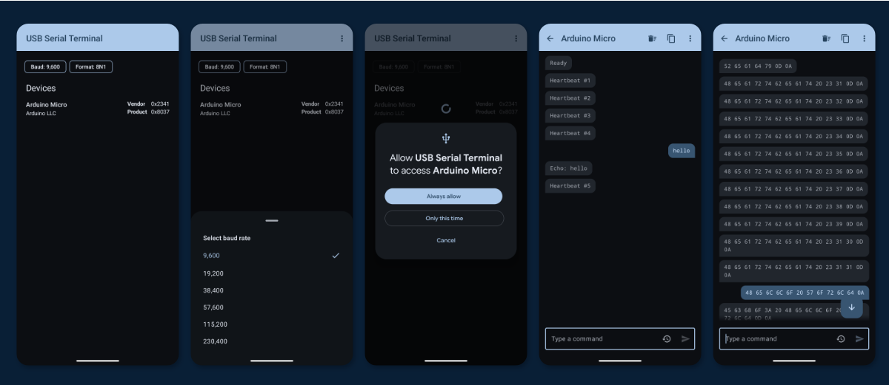

# USB Serial Terminal

Android app for communicating with USB serial devices over USB Host mode.

## Requirements

- Android 8.0 (API 26) or higher
- A device with USB Host mode support and a USB-OTG cable/adapter

## Tech stack

- Kotlin, Jetpack Compose, Material 3
- Single-module MVVM architecture
- [Koin](https://insert-koin.io/) for dependency injection
- [Navigation 3](https://developer.android.com/guide/navigation/navigation-3) for screen navigation
- [usb-serial-for-android](https://github.com/mik3y/usb-serial-for-android) for USB CDC/FTDI/CH340 serial communication

## Testing with an Arduino

The [`arduino/SerialTerminalTestSketch`](arduino/SerialTerminalTestSketch) folder contains a sketch for an Arduino that:

- Prints `Ready` once a terminal connects
- Echoes back any line it receives, prefixed `Echo: `
- Responds to `LED_ON` / `LED_OFF` by toggling the onboard LED
- Sends a `Heartbeat #N` line every 2 seconds on its own

## License

Licensed under the [Apache License Version 2.0.](LICENSE)
